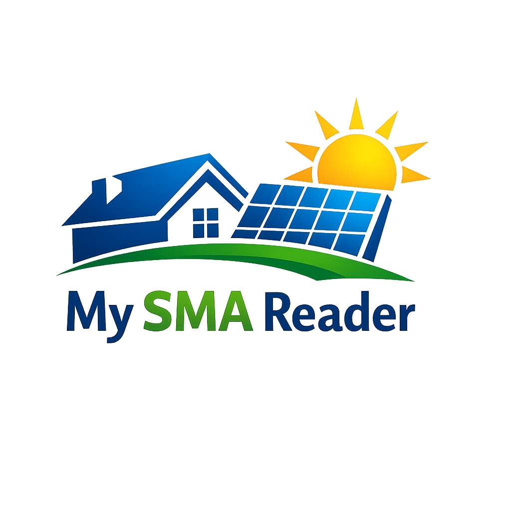

# My SMA Reader

A custom Home Assistant integration for reading data from older SMA inverters over Modbus TCP.

## Features

* Read inverter power
* Read daily energy yield
* Read total energy yield
* Read inverter temperature
* Local polling via Modbus TCP
* No MQTT required

## Configuration

The integration requires:

* IP address of the SMA inverter
* Modbus TCP port (default: 502)
* Scan interval

## Installation

### HACS

1. Add this repository as a custom repository in HACS.
2. Select **Integration** as category.
3. Install **My SMA Reader**.
4. Restart Home Assistant.
5. Add the integration through **Settings → Devices & Services**.

## Status

This project is currently under development.

## Compatibility

Initially developed for older SMA inverters that expose data through Modbus TCP.

## Author

Karel Vandevoorde
